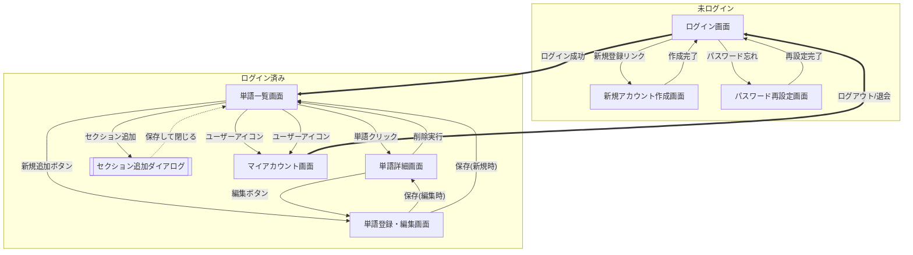

```mermaid
flowchart TD
    %% 認証・未ログイン系の画面
    subgraph 認証エリア [未ログイン]
        Login[ログイン画面]
        Register[新規アカウント作成画面]
        ResetPass[パスワード再設定画面]
    end

    %% メイン機能・ログイン済みの画面
    subgraph メインエリア [ログイン済み]
        WordList[単語一覧画面]
        WordDetail[単語詳細画面]
        WordEdit[単語登録・編集画面]
        SectionDialog[[セクション追加ダイアログ]]
        MyPage[マイアカウント画面]
    end

    %% 未ログイン内の遷移
    Login -- 新規登録リンク --> Register
    Login -- パスワード忘れ --> ResetPass
    Register -- 作成完了 --> Login
    ResetPass -- 再設定完了 --> Login

    %% 認証の境界を越える遷移
    Login == ログイン成功 ==> WordList
    MyPage == ログアウト/退会 ==> Login

    %% メインエリア内の遷移
    WordList -- 単語クリック --> WordDetail
    WordList -- 新規追加ボタン --> WordEdit
    WordList -- セクション追加 --> SectionDialog
    SectionDialog -. 保存して閉じる .-> WordList
    
    WordDetail -- 編集ボタン --> WordEdit
    WordEdit -- 保存(編集時) --> WordDetail
    WordEdit -- 保存(新規時) --> WordList
    WordDetail -- 削除実行 --> WordList

    WordList -- ユーザーアイコン --> MyPage

    WordList -- ユーザーアイコン --> MyPage
```